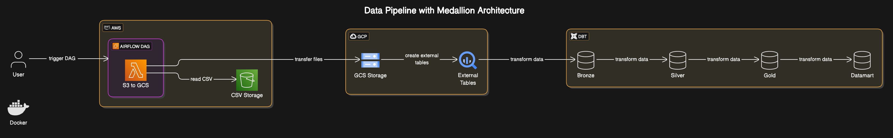

# Upstart Client Technical Project Documentation

## Project Overview
This project implements a complete data pipeline that extracts raw data from AWS S3, transforms it through a medallion architecture in Google Cloud Platform, and delivers analytical insights via BigQuery. The solution leverages Terraform for infrastructure, Airflow for orchestration, and DBT for transformation.


## Data Architecture



## Technical Implementation

### 1. Data Ingestion Process
- **Source Data**: Manually loaded CSV files into AWS S3 bucket to simulate external data sources
- **Transfer Mechanism**: 
  - Custom-built Airflow operator handles S3-to-GCS transfers
  - Configured service accounts and permissions via Terraform

### 2. Local Development
- **Docker Containers**:
  - Airflow (Astro) 1.33.2
  - DBT Core 1.9.3 + BigQuery Plugin (1.9.1)
 

### 2.1 GCP Infrastructure
- **Storage**: 
  - GCS buckets provisioned with Terraform
- **Data Catalog**: 
  - BigQuery external tables pointing to GCS files
- **Security**:
  - Fine-grained IAM roles for service accounts
  - Network access restrictions


### 3. Data Transformation Pipeline
**Medallion Architecture Implementation**:

| Layer       | Naming Prefix | Description                                                                 |
|-------------|---------------|-----------------------------------------------------------------------------|
| **Bronze**  | `raw_`        | Preserves source data exactly as received                                   |
| **Silver**  | `store_`      | Cleaned data with:<br>- Standardized formats<br>- Null handling<br>- FK/PK relations |
| **Gold**    | `publish_`    | Business-ready aggregates and derived metrics                               |
| **Datamart**|               | Analytical views answering specific business questions                      |


### Bronze Models Overview

  ### Design Philosophy
  - **Immutable Storage**: Preserves raw source data exactly as ingested
  - **Lightweight Processing**: Only applies deduplication (if needed) and adds metadata
  - **Source Alignment**: Maintains 1:1 field mapping with origin systems
  - **Pipeline Metadata**: Adds tracking columns for data lineage

  #### File Paths Configuration
  File path of the models and tests related to these models inside the Github project:
  ```yaml
  models:
    bronze: "airflow_dbt/include/dbt/models/bronze"
      - raw_products.sql
      - raw_sales_order_detail.sql
      - raw_sales_order_header.sql
  tests:
    bronze: "airflow_dbt/include/dbt/models/docs/bronze"
      - raw_products.yml
      - raw_sales_order_detail.yml
      - raw_sales_order_header.yml
  ```

#### 1. Bronze Products (`raw_products`)

**Source**: `EXT_S3_FILES.src_products`  
**Purpose**: Initial landing zone for product master data  

```sql
{{
    config(
        schema='bronze',
        materialized='table',
        cluster_by=['ProductId']  -- Optimized for product-centric queries
    )
}}

-- Prioritizes ProductCategoryName with description to dedupe
WITH dedupe_data AS (
    SELECT 
        ProductID,
        ProductDesc,
        ProductNumber,
        MakeFlag,
        Color,
        SafetyStockLevel,
        ReorderPoint,
        StandardCost,
        ListPrice,
        Size,
        SizeUnitMeasureCode,
        Weight,
        WeightUnitMeasureCode,
        ProductCategoryName,
        ProductSubCategoryName,
        CURRENT_TIMESTAMP() AS _internal_sequence
    FROM {{ source('EXT_S3_FILES', 'src_products') }}
    QUALIFY ROW_NUMBER() OVER (PARTITION BY ProductID ORDER BY 
         CASE
             WHEN ProductCategoryName IS NOT NULL THEN 1
             ELSE 2
         END ASC) = 1
)

SELECT *
FROM dedupe_data
;
```

#### 2. Bronze Sales Order Details (`raw_sales_order_detail`)

**Source**: `EXT_S3_FILES.src_sales_order_detail`  
**Purpose**: Initial landing zone for sales order line items  

```sql
{{
    config(
        schema='bronze',
        materialized='table',
        cluster_by=['SalesOrderDetailID']  -- Optimized for line-item queries
    )
}}

SELECT
    SalesOrderID,
    SalesOrderDetailID,
    OrderQty,
    ProductID,
    UnitPrice,
    UnitPriceDiscount,
    CURRENT_TIMESTAMP() AS _internal_sequence
FROM {{ source('EXT_S3_FILES', 'src_sales_order_detail') }}
;
```

#### 3. Bronze Sales Order Headers (`raw_sales_order_header`)

**Source**: `EXT_S3_FILES.src_sales_order_header`  
**Purpose**: Initial landing zone for sales order header information  

```sql
{{
    config(
        schema='bronze',
        materialized='table',
        cluster_by=['SalesOrderID']  -- Optimized for order-level queries
    )
}}

SELECT 
    SalesOrderID,
    OrderDate,
    ShipDate,
    OnlineOrderFlag,
    AccountNumber,
    CustomerID,
    SalesPersonID,
    Freight,
    CURRENT_TIMESTAMP() AS _internal_sequence
FROM {{ source('EXT_S3_FILES', 'src_sales_order_header') }}
;
```

### Silver Models Overview

### Design Philosophy
- **Curated Data**: Applies business logic and standardization
- **Data Transformation**: Performs data type conversions and applies consistent formatting and cleansing to column values 
- **Data Quality**: Enforces data integrity through constraints, validations, and quality checks to ensure reliable outputs
- **Traceability**: Maintains complete lineage from source systems to transformed datasets, ensuring full auditability

#### File Paths Configuration
File path of the models and tests related to these models inside the Github project:
```yaml
models:
  silver: "airflow_dbt/include/dbt/models/silver"
    - store_products.sql
    - store_sales_order_detail.sql
    - store_sales_order_header.sql
tests:
  silver: "airflow_dbt/include/dbt/models/docs/silver"
    - store_products.yml
    - store_sales_order_detail.yml
    - store_sales_order_header.yml
```

#### 1. Silver Products (`store_products`)

**Source**: `bronze.raw_products`  
**Purpose**: Cleaned product dimension with proper typing  

```sql
{{
    config(
        schema='silver',
        materialized='table',
        cluster_by=['ProductId']
    )
}}

SELECT 
    CAST(ProductId AS INT)                         AS ProductId,
    ProductDesc,
    ProductNumber,
    CAST(MakeFlag AS BOOL)                         AS MakeFlag,
    -- Standardize null colors
    CASE WHEN Color = '' THEN NULL ELSE Color END  AS Color,
    CAST(SafetyStockLevel AS INT)                  AS SafetyStockLevel,
    CAST(ReorderPoint AS INT)                      AS ReorderPoint,
    CAST(StandardCost AS FLOAT64)                  AS StandardCost,     
    CAST(ListPrice AS FLOAT64)                     AS ListPrice,
    Size,
    SizeUnitMeasureCode,
    Weight,
    WeightUnitMeasureCode,
    ProductCategoryName,
    ProductSubCategoryName,
    _internal_sequence                             AS _sequence,
    CURRENT_TIMESTAMP()                            AS _internal_sequence
FROM {{ ref('raw_products')}}
```

#### 2. Silver Sales Order Detail (`store_sales_order_detail`)

**Source**: `bronze.raw_sales_order_detail`  
**Purpose**: Cleaned sales transaction facts

```sql
{{
    config(
        schema='silver',
        materialized='table',
        cluster_by=['SalesOrderDetailID', 'SalesOrderID', 'ProductID'],
    )
}}


SELECT
    CAST(SalesOrderDetailID AS INT)    AS SalesOrderDetailID,
    CAST(SalesOrderID AS INT)          AS SalesOrderID,
    ABS(CAST(OrderQty AS INT))         AS OrderQty,
    CAST(ProductID AS INT)             AS ProductID,
    CAST(UnitPrice AS FLOAT64)         AS UnitPrice,
    CAST(UnitPriceDiscount AS FLOAT64) AS UnitPriceDiscount,
    _internal_sequence                 AS _sequence,
    CURRENT_TIMESTAMP()                AS _internal_sequence
FROM {{ ref('raw_sales_order_detail') }}
```

#### 3. Silver Sales Order Header (`store_sales_order_header`)

**Source**: `bronze.raw_sales_order_header'`  
**Purpose**: Cleaned order header information  

```sql
{{
    config(
        schema='silver',
        materialized='table',
        cluster_by=['SalesOrderID']
    )
}}


SELECT 
    CAST(SalesOrderID AS INT)                              AS SalesOrderID,
    CASE
        WHEN REGEXP_CONTAINS(OrderDate, r'^\d{4}-\d{2}$') THEN PARSE_DATE('%Y-%m-%d', CONCAT(OrderDate, '-01')) 
        ELSE PARSE_DATE('%Y-%m-%d', OrderDate) 
    END                                                    AS OrderDate,                                                
    PARSE_DATE('%Y-%m-%d', ShipDate)                       AS ShipDate,
    CAST(OnlineOrderFlag AS BOOL)                          AS OnlineOrderFlag,
    AccountNumber,
    CAST(CustomerID AS INT)                                AS CustomerID,
    CAST(NULLIF(SalesPersonID, '') AS INT)                 AS SalesPersonID,
    CAST(Freight AS FLOAT64)                               AS Freight,
    _internal_sequence                                     AS _sequence,
    CURRENT_TIMESTAMP()                                    AS _internal_sequence
FROM {{ ref('raw_sales_order_header') }}
```

### Gold Models Overview

### Design Philosophy
- **Business Metrics**: Calculates key performance indicators and derived metrics
- **Analytical Ready**: Structures data for direct consumption by BI tools and analysts
- **Performance Optimized**: Clustered for common query patterns
- **Business Logic**: Encodes domain-specific calculations (e.g., business days)
- **Simplified Consumption**: Joins related entities into analytical datasets

#### File Paths Configuration
File path of the models and tests related to these models inside the Github project:
```yaml
models:
  gold: "airflow_dbt/include/dbt/models/gold"
    - publish_orders.sql
    - publish_products.sql
tests:
  silver: "airflow_dbt/include/dbt/models/docs/gold"
    - publish_orders.yml
    - publish_products.yml
```

#### 1. Gold Orders (`publish_products`)

**Source**: `silver.store_sales_order_detail` `silver.store_sales_order_header`  
**Purpose**: Unified sales model with key business metrics  

```sql
{{
    config(
        schema='gold',
        materialized='table',
        cluster_by=['SalesOrderID', 'LeadTimeInBusinessDays']
    )
}}


WITH cte_lead_time AS (
    SELECT 
        SalesOrderID,
        OrderDate,
        ShipDate,
        ---generate date array between OrderDate and ShipDate and count only business days (excluding Saturdays and Sundays)
        SUM(CASE 
                WHEN EXTRACT(DAYOFWEEK FROM DATE_ADD(OrderDate, INTERVAL offset DAY)) NOT IN (1, 7) 
                THEN 1 
                ELSE 0 
            END) AS LeadTimeInBusinessDays
    FROM {{ ref('store_sales_order_header') }},
        UNNEST(GENERATE_ARRAY(0, DATE_DIFF(ShipDate, OrderDate, DAY))) AS offset
    GROUP BY ALL
)

SELECT
    d.* EXCEPT(_sequence, _internal_sequence),
    h.* EXCEPT(SalesOrderID, Freight, _sequence, _internal_sequence), 
    Freight                                    AS TotalOrderFreight,
    OrderQty * (UnitPrice - UnitPriceDiscount) AS TotalLineExtendedPrice,
    c.LeadTimeInBusinessDays
FROM {{ ref('store_sales_order_detail') }} d
LEFT JOIN {{ ref('store_sales_order_header') }} h
    ON d.SalesOrderID = h.SalesOrderID
LEFT JOIN cte_lead_time c
    ON d.SalesOrderID = c.SalesOrderID
```

#### 2. Gold Products (`publish_products`)

**Source**: `store.products`  
**Purpose**: Unified products model with key business metrics

```sql
{{
    config(
        schema='gold',
        materialized='table',
        cluster_by=['ProductId', 'ProductCategoryName', 'ProductSubCategoryName']
    )
}}


SELECT 
    ProductId,
    ProductDesc,
    ProductNumber,
    MakeFlag,
    IF(Color = '', 'N/A', Color) AS Color,
    SafetyStockLevel,
    ReorderPoint,
    StandardCost,
    ListPrice,
    Size,
    SizeUnitMeasureCode,
    Weight,
    WeightUnitMeasureCode,
    CASE 
        WHEN ProductCategoryName = '' THEN 
            CASE 
                WHEN ProductSubCategoryName IN ('Gloves', 'Shorts', 'Socks', 'Tights', 'Vests') THEN 'Clothing'
                WHEN ProductSubCategoryName IN ('Locks', 'Lights', 'Headsets', 'Helmets', 'Pedals', 'Pumps') THEN 'Accessories' 
                WHEN ProductSubCategoryName LIKE '%Frames%' OR ProductSubCategoryName IN ('Wheels', 'Saddles') THEN 'Components' 
                ELSE ProductCategoryName
            END 
        ELSE ProductCategoryName
    END AS ProductCategoryName,
    ProductSubCategoryName
FROM {{ ref('store_products') }}
```

## Datamart Models Overview

### Design Philosophy
- **Business-Focused**: Answers specific analytical questions
- **Simplified Access**: Provides ready-to-use metrics for business users
- **Optimized for Consumption**: Materialized as views for real-time data
- **Self-Documenting**: Clear metric definitions and calculations

#### File Paths Configuration
```yaml
models:
  datamart: "airflow_dbt/include/dbt/models/datamart"
    - avg_lead_time_prod_category.sql
    - color_with_highest_reven_year.sql
```

#### 1. Datamart Lead Time (`avg_lead_time_prod_category`)

**Source**: `gold.publish_orders` `gold.publish_products`

**Purpose**: Provides average lead time metrics by product category to answer "What is the average LeadTimeInBusinessDays by ProductCategoryName?" question

```sql
{{
    config(
        schema='datamart',
        materialized='view'
    )
}}

---What is the average LeadTimeInBusinessDays by ProductCategoryName?
SELECT
    IF(ProductCategoryName = '', 'Unknown', ProductCategoryName) AS ProductCategoryName,
    AVG(LeadTimeInBusinessDays)                                  AS AverageLeadTime
FROM {{ ref('publish_orders') }} o 
LEFT JOIN {{ ref('publish_products') }} p 
    ON o.ProductID = p.ProductID
GROUP BY 1
```

#### 2. Datamart Color Revenue (`color_with_highest_reven_year`)

**Source**: `gold.publish_orders` `gold.publish_products`

**Purpose**: Identifies top revenue-generating product colors by year to answer "Which color generated the highest revenue each year?" question
```sql
{{
    config(
        schema='datamart',
        materialized='view'
    )
}}

---Which color generated the highest revenue each year?

WITH year_color_revenue_cte AS (
SELECT
    EXTRACT(YEAR FROM OrderDate)  AS Year,
    p.Color,
    SUM(o.TotalLineExtendedPrice) AS Revenue
FROM {{ ref('publish_orders') }} o
LEFT JOIN {{ ref('publish_products') }} p
    ON o.ProductID = p.ProductID
GROUP BY ALL
) 


SELECT *
FROM year_color_revenue_cte
QUALIFY RANK() OVER (PARTITION BY Year ORDER BY Revenue DESC) = 1
```

### 4. Key Business Logic Implementations

**Product Data Enhancements**:
- Standardized empty color values to 'N/A'
- Created product category hierarchy based on subcategory names
- Implemented data quality checks for mandatory fields, like non_null and unique

**Sales Order Transformations**:
- Calculated accurate business days between order and shipment
- Computed line item totals with proper discount application
- Joined header and detail tables with referential integrity checks

### 5. Orchestration
- **Airflow DAG** schedules daily pipeline runs with:
  1. File transfer from S3 to GCS
  2. DBT model execution (bronze → silver → gold)
  3. Data quality validation in DBT inside the layers for every single model
  4. Alerting for failures (warn)

- **Dependency Management**:
  - Ensures tables are loaded in correct sequence
  - Handles upstream/downstream relationships

### 6. Data Quality Framework
- **DBT Tests** for:
  - Primary/foreign key relationships
  - Non-null constraints on critical fields
  - Value validation (positive quantities, valid values)
  - Custom tests with business logic

### 7. Analytical Deliverables
**Solved Business Questions**:
1. Annual revenue by product color
2. Average processing time by product category

**Implementation Approach**:
- Created dedicated datamart views
- Optimized queries for performance
- Documented calculation methodologies

## Future Enhancement Opportunities

1. **Incremental Processing**
   - Requires adding ingestion timestamps to source files to create incremental strategies to dbt models
   - If a date field was present in the dimension table (products), it would be possible to implement a SCD2 logic for slowly changing dimensions using the dbt snapshot

2. **Advanced Monitoring**
   - Column-level lineage tracking
   - Automated anomaly detection (using dbt.elementary, for example)
   - Data freshness dashboards

3. **Expanded Validation**
   - Unit tests for transformation logic
   - Cross-system consistency checks
   - Historical trend analysis

## Technical Requirements
- **Cloud Services**: GCP (GCS, BigQuery), AWS S3
- **Tools**: Terraform ≥1.5, Airflow 2.6+, DBT Core 1.5+
- **Data Formats**: CSV
- **Access Controls**: IAM-based permission model

## Implementation Notes
- **Design Choice**: External tables were preferred over direct loading to preserve raw data
- **Challenge Addressed**: Initially attempted Spark but i was facing some problems with Hadoop custom jars do connect with GCS and Airflow so pivoted to pure SQL due to dependency conflicts
- **Tradeoff**: Current implementation requires full refreshes due to missing timestamps in source data

## Value Delivered
- **Reliable Data Pipeline**: Daily automated processing
- **Trusted Data Foundation**: Rigorous quality checks
- **Actionable Insights**: Ready-to-use analytical views
- **Extensible Framework**: Designed for future growth
